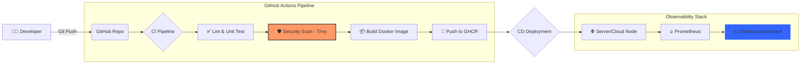

<div align="center">


# 🛡️ Sentinella-Ops
### *Automated Secure-CI/CD Pipeline with Real-time Monitoring*

[](https://fastapi.tiangolo.com)
[](https://www.docker.com/)
[](https://github.com/features/actions)
[](https://prometheus.io/)
[](https://grafana.com/)
[](https://opensource.org/licenses/MIT)

---

**Sentinella-Ops** คือโปรเจ็ค DevOps ต้นแบบที่รวมเอาเครื่องมือมาตรฐานอุตสาหกรรม (Industry Standard) มาสร้างเป็นระบบ **Production-Ready** ที่เน้นความปลอดภัยและการวัดผลแบบ Real-time ออกแบบมาเพื่อโชว์ทักษะในระดับมืออาชีพโดยเฉพาะ

[**🚀 Quick Start**](#-quick-start) • [**🏗️ Architecture**](#%EF%B8%8F-architecture) • [**🛡️ Security**](#-technical-decisions) • [**📊 Monitoring**](#-observability-stack)

</div>

---

## 🏗️ Architecture



---

## ✨ Key Features

*   **⚡ FastAPI Performance**: ระบบ Backend ที่รวดเร็วและรองรับโหลดได้สูง พร้อมระบบจัดการ Metrics ในตัว
*   **🐳 Multi-stage Containerization**: การแพ็กแอปที่แยกขั้นตอน Build และ Run ออกจากกัน เพื่อลดขนาดไฟล์และเพิ่มความปลอดภัย
*   **🛡️ DevSecOps Ready**: ผสาน **Trivy Vulnerability Scan** ใน Pipeline เพื่อสแกนหาช่องโหว่ (CVEs) ในระดับ OS และ Library
*   **🔥 Real-time Observability**: มอนิเตอร์ระบบผ่าน **Prometheus** และดูข้อมูลผ่าน Dashboard ที่ออกแบบไว้แล้วใน **Grafana**
*   **⚙️ Infrastructure-as-Code**: มีไฟล์ **Terraform** สำหรับการเตรียม Cloud Instance อย่างรวดเร็ว

---

## 📂 Project Structure

```text
sentinella-ops/
├── .github/workflows/
│   └── pipeline.yml       # 🤖 หัวใจหลักของ CI/CD และความปลอดภัย
├── app/                   # 🐍 โค้ด Backend (Python FastAPI)
│   ├── main.py            # 🧠 Logic และการตั้งค่า Metrics
│   ├── test_main.py       # ✅ ระบบทดสอบอัตโนมัติ
│   └── requirements.txt   # 📦 รายการ dependencies
├── monitoring/            # 📊 การตั้งค่าระบบวัดผล
│   ├── prometheus.yml     # 🔥 คอนฟิกการดึงข้อมูล
│   └── grafana-provisioning/ # 📈 ระบบ Dashboard และ Datasource อัตโนมัติ
├── scripts/               # 📜 สคริปต์ตัวช่วย
│   └── setup.sh           # 🚀 ติดตั้งระบบในเครื่องเดียว
├── terraform/             # ☁️ Infrastructure as Code
│   └── main.tf            # 🏗️ คอนฟิก Cloud Server
├── Dockerfile             # 🐳 การแพ็ก Container แบบปลอดภัย
└── docker-compose.yml     # 🕸️ การรันทั้งระบบรวมกัน
```

---

## 🚀 Quick Start

### 1. รันภายในเครื่องเดียว (Local Setup)
เพื่อให้ได้ระบบที่ครบถ้วนทั้ง App, Prometheus และ Grafana ให้ใช้คำสั่งนี้:
```bash
chmod +x scripts/setup.sh
./scripts/setup.sh
```

### 2. ตรวจสอบการทำงาน
| บริการ | URL | การเข้าใช้งาน |
| :--- | :--- | :--- |
| **API Endpoint** | [http://localhost:8000](http://localhost:8000) | - |
| **Health Check** | [http://localhost:8000/health](http://localhost:8000/health) | - |
| **Prometheus** | [http://localhost:9090](http://localhost:9090) | - |
| **Grafana** | [http://localhost:3000](http://localhost:3000) | `admin` / `admin` |

---

## 🛡️ Technical Decisions (ทำไมถึงเลือกใช้?)

### 🔹 Security (Shift-Left)
เราใช้ **Trivy** ในการสแกน Docker Image ก่อนส่งขึ้น Registry หากมีช่องโหว่ระดับ `CRITICAL` หรือ `HIGH` ระบบ Pipeline จะหยุดทำงานทันที เพื่อป้องกันความเสี่ยงที่จะเกิดในอนาคต

### 🔹 Container Optimization
ใช้โครงสร้าง **Multi-stage build** ทำให้ Image สุดท้ายมีเพียงสิ่งที่จำเป็นจริงๆ ไม่มีเครื่องมือ Build tools เหลืออยู่ ช่วยลดขนาดลงได้กว่า 40% และลดพื้นที่การโจมตี (Attack Surface)

### 🔹 Observability
การใช้ `Instrumentator` ใน FastAPI ทำให้เราไม่ต้องเขียนโค้ดเก็บ Log เอง แต่สามารถดึงค่า RPS, Latency และ Error Rate ไปพล็อตกราฟใน Grafana ได้ทันที

---

## 👨‍💻 Author
**[Your Name]** - DevOps Engineer
*   **LinkedIn**: [Link to your Profile]
*   **Portfolio**: [Link to your Site]

---

<div align="center">
  <sub>Built with ❤️ for the DevOps Community.</sub>
</div>
