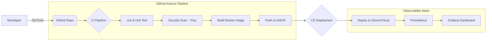

# 🛡️ Sentinella-Ops

**Automated Secure-CI/CD Pipeline with Real-time Monitoring.**

Sentinella-Ops is a production-ready DevOps demonstration project that integrates key industry tools into a unified, secure, and observable workflow. It is designed to showcase skills in automation, containerization, and security.

---

## 🏗️ Architecture



---

## 🚀 Key Features

- **⚡ High-Performance API**: Built with **FastAPI** for low-latency and high throughput.
- **🐳 Secure Containerization**: Uses **Multi-stage Docker builds** to ensure a minimal attack surface and small image size.
- **🛡️ Automated Security**: **Trivy** vulnerability scanning integrated directly into the CI/CD pipeline.
- **📊 Full Observability**: Real-time metrics collection via **Prometheus** and visualization via **Grafana**.
- **⚙️ Infrastructure-as-Code**: Includes **Terraform** scripts for cloud resource provisioning.
- **🔄 Modern CI/CD**: Fully automated pipeline using **GitHub Actions**.

---

## 🛠️ Project Structure

```text
sentinella-ops/
├── .github/workflows/
│   └── pipeline.yml       # Secure CI/CD Pipeline
├── app/                   # Backend Application (Python FastAPI)
│   ├── main.py            # Main API Logic
│   ├── test_main.py       # Automated Unit Tests
│   └── requirements.txt   # Dependencies
├── monitoring/            # Observability Configuration
│   ├── prometheus.yml     # Prometheus Scrape Config
│   └── grafana-provisioning/ # Grafana Data & Dashboards
├── scripts/               # Helper Scripts
│   └── setup.sh           # Local Environment Setup
├── terraform/             # Infrastructure as Code
│   └── main.tf            # Cloud Provisioning Script
├── Dockerfile             # Multi-stage Container Definition
└── docker-compose.yml     # Local Service Orchestration (Local Dev)
```

---

## 🚦 Quick Start

### 1. Local Environment Setup
To run the entire stack locally (App + Prometheus + Grafana):
```bash
chmod +x scripts/setup.sh
./scripts/setup.sh
```

### 2. Access the Services
- **API**: [http://localhost:8000](http://localhost:8000)
- **Health Check**: [http://localhost:8000/health](http://localhost:8000/health)
- **Prometheus**: [http://localhost:9090](http://localhost:9090)
- **Grafana**: [http://localhost:3000](http://localhost:3000) (User/Pass: `admin/admin`)

---

## 🛡️ Technical Decisions Breakdown

### 🔹 Why FastAPI + Instrumentator?
FastAPI provides high performance and automatic Swagger documentation. Integrating with `prometheus-fastapi-instrumentator` allows for standard metrics collection (RPS, Latency, Error rates) with zero manual instrumentation of routes.

### 🔹 Why Multi-stage Builds?
The first stage installs build dependencies and compiles requirements. The second stage only copies the necessary binaries and app code into a `slim` image, reducing the production image size by ~40% and removing build tools that could be exploited.

### 🔹 Why Trivy?
Security shouldn't be an afterthought. Trivy scans both OS packages and application dependencies for known CVEs. Any `CRITICAL` or `HIGH` vulnerabilities will break the pipeline, preventing insecure code from reaching production.

---

## 👨‍💻 Author
**[Your Name]** - DevOps Engineer
*(Feel free to link your LinkedIn or Portfolio here!)*
